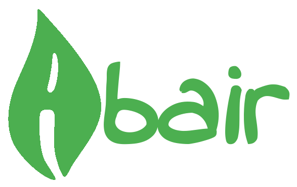

# Abair

**Irish Speech and Language Technologies**

## Synopsis

This is the source code for the Abair project.

## Motivation

The goal of the Abair project is to develop and provide state-of-the-art Irish speech and language technologies for the public.

This web application is designed to enable public access to the technologies, and allow developers to easily contribute.

## Features

The main features have been adapted and extended from [this template](https://github.com/suren-atoyan/react-pwa)

## Additional Features

- ✅ [Storybook](#storybook)

#### Storybook

[Storybook](https://storybook.js.org/) is an open source tool for building UI components and pages in isolation. It streamlines UI development, testing, and documentation.

## License

[MIT](./LICENSE)
